  

  

  
  
  
  

 

## `~/about` — live session

  

## `~/tech-stack`

| | |
|---:|:---|
| **Languages** |  |
| **Frontend** |  |
| **Backend** |  |
| **Cloud & Infra** |  |
| **Tools** |  |

## `~/github-analytics`

  
  

 

  

 

  

 

  <picture>
    <source media="(prefers-color-scheme: dark)" srcset="https://raw.githubusercontent.com/yombell-sisniegas/yombell-sisniegas/output/github-snake.svg" />
    <source media="(prefers-color-scheme: light)" srcset="https://raw.githubusercontent.com/yombell-sisniegas/yombell-sisniegas/output/github-snake-light.svg" />
    
  </picture>

## `~/now-building`

<table align="center">
  <tr>
    <td>
      <h3 align="center">Reech AI</h3>
      

        AI-powered platforms for real businesses — intelligent agents, RAG pipelines, 
        and realtime products built on TypeScript, Next.js, Supabase and Google Cloud.
      

      

        
      

    </td>
  </tr>
</table>

## `~/connect`

  
  
  

 

  <code>// designed & hand-coded — animated SVGs, zero templates</code>

